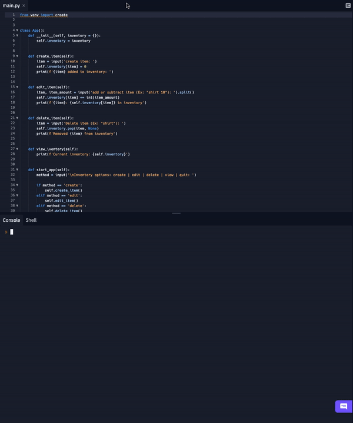

## Inventory App

- run in terminal: python inventory_app_shopify.py
- enter the presented input
  - create: create item
  - edit: add or remove items in stock
  - view: view inventory
  - delete: delete item in inventory
  - quit: quit application

